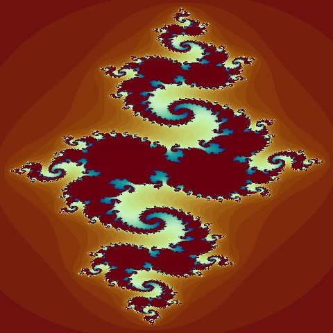
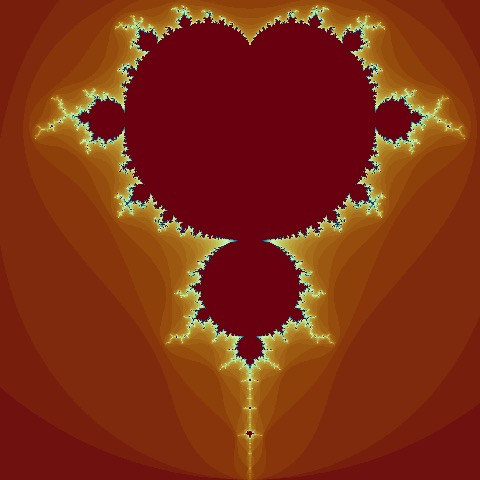
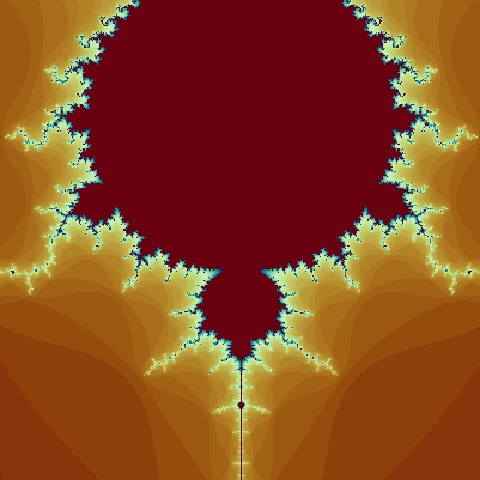

[](https://travis-ci.org/msuzen/Julia)
[](https://cran.r-project.org/package=Julia)
[](https://cran.r-project.org/package=Julia)
[](https://cran.r-project.org/package=Julia)
[](http://www.gnu.org/licenses/gpl-3.0.html)

# Julia
Julia: Fractal Image Data Generator

The package aim at generating Julia and Mandelbrot sets with given initial conditions and resolution using
an escape time algorithm. A resulting data matrix is represents escape times at each matrix entry.

## Julia Set

[Julia set](https://en.wikipedia.org/wiki/Julia_set) data can be generated with the `JuliaImage` function. 
An example case, 

```r
imageN <- 2000
centre <- 0.0
L <- 4.0
C <- -0.8 + 0.156i
image_matrix <- JuliaImage(imageN, centre, L, C)
```

A sample visualisation with R's hcl palette `Roma` as set values on 
a grid given as a matrix.

```r
par(mar=c(0, 0, 0, 0))
image(image_matrix[550:1450, 200:1800], 
      col=hcl.colors(2000, palette="Roma"), 
      axes=FALSE, useRaster=TRUE)
```

 

## Mandelbrot set 

[Mandelbrot set](https://en.wikipedia.org/wiki/Mandelbrot_set) data can be generated with `MandelImage` function.

An example to generate the data:

```r
imageN <- 2000; 
centre <- 0.0
L <- 4.0
image_matrix <- MandelImage(imageN, centre, L);
```

A sample visualisation with R's hcl palette `Roma` as set values on 
a grid given as a matrix.

```r
par(mar=c(0, 0, 0, 0))
image(image_matrix[350:1600, 1:1250], 
      col=hcl.colors(2000,  palette="Roma"),
      axes=FALSE, useRaster=TRUE)
```
 

And an other zooming 
```r
par(mar=c(0, 0, 0, 0))
image(image_matrix[800:1200, 200:600], 
      col=hcl.colors(2000,  palette="Roma"),
      axes=FALSE, useRaster=TRUE)
```
 

## Acknowledgements

Author is grateful to Ranjan Maitra for his suggestions on reviving the package.

